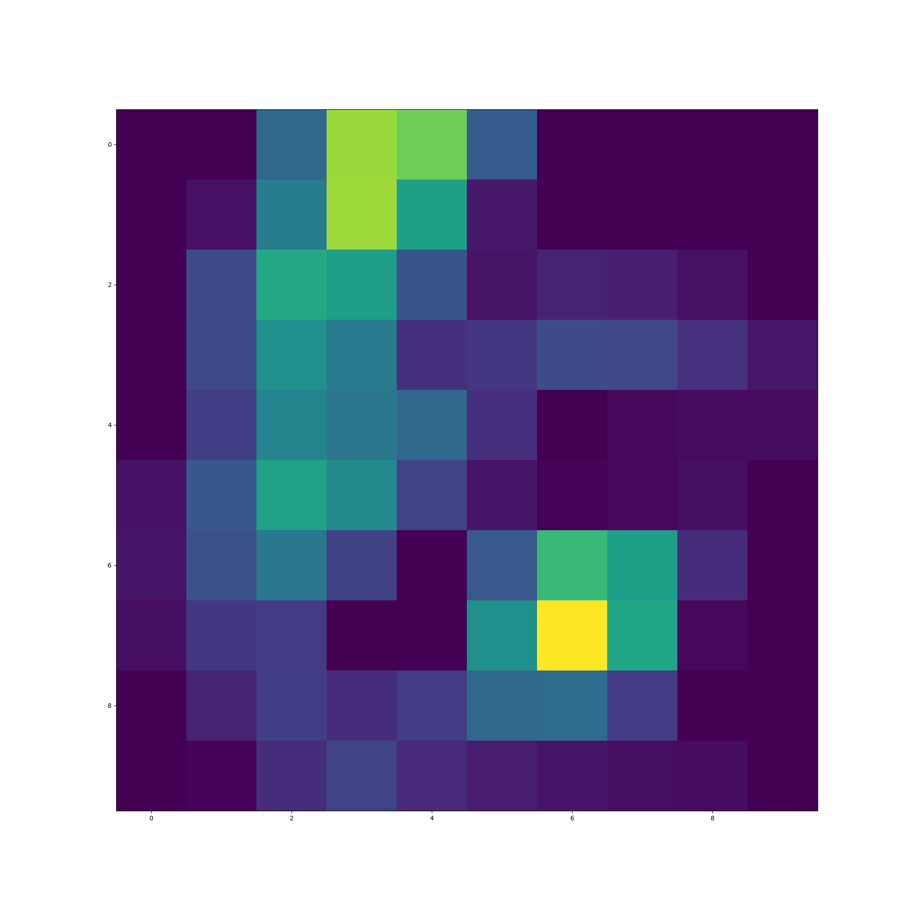
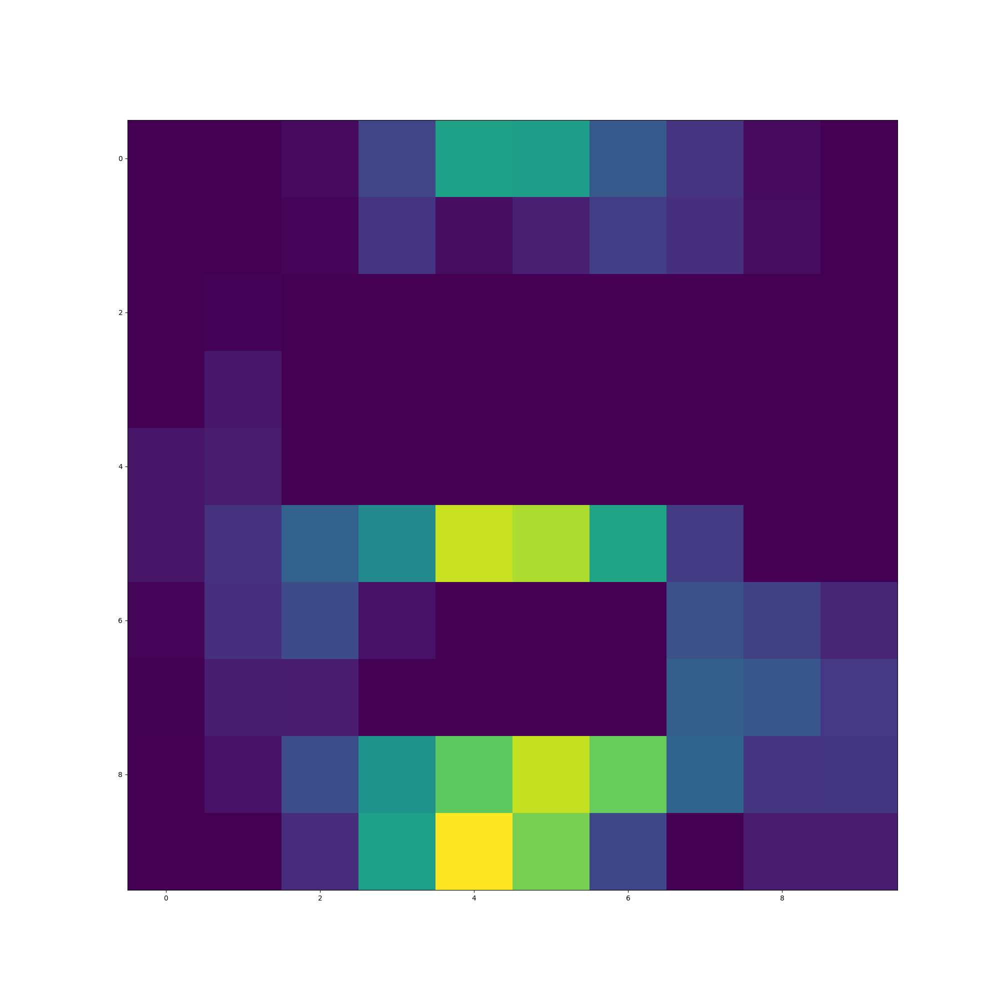
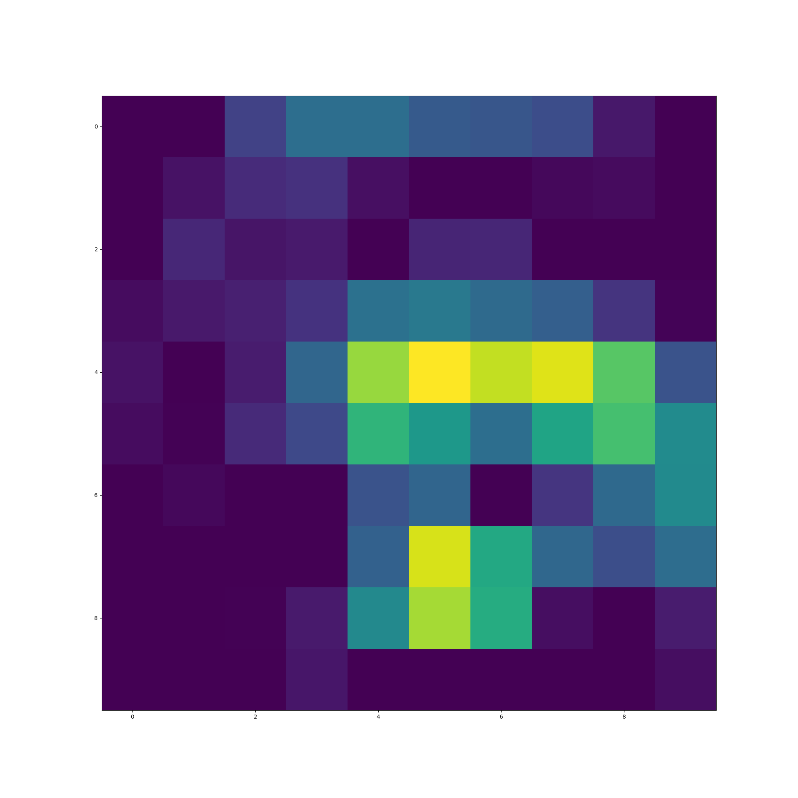
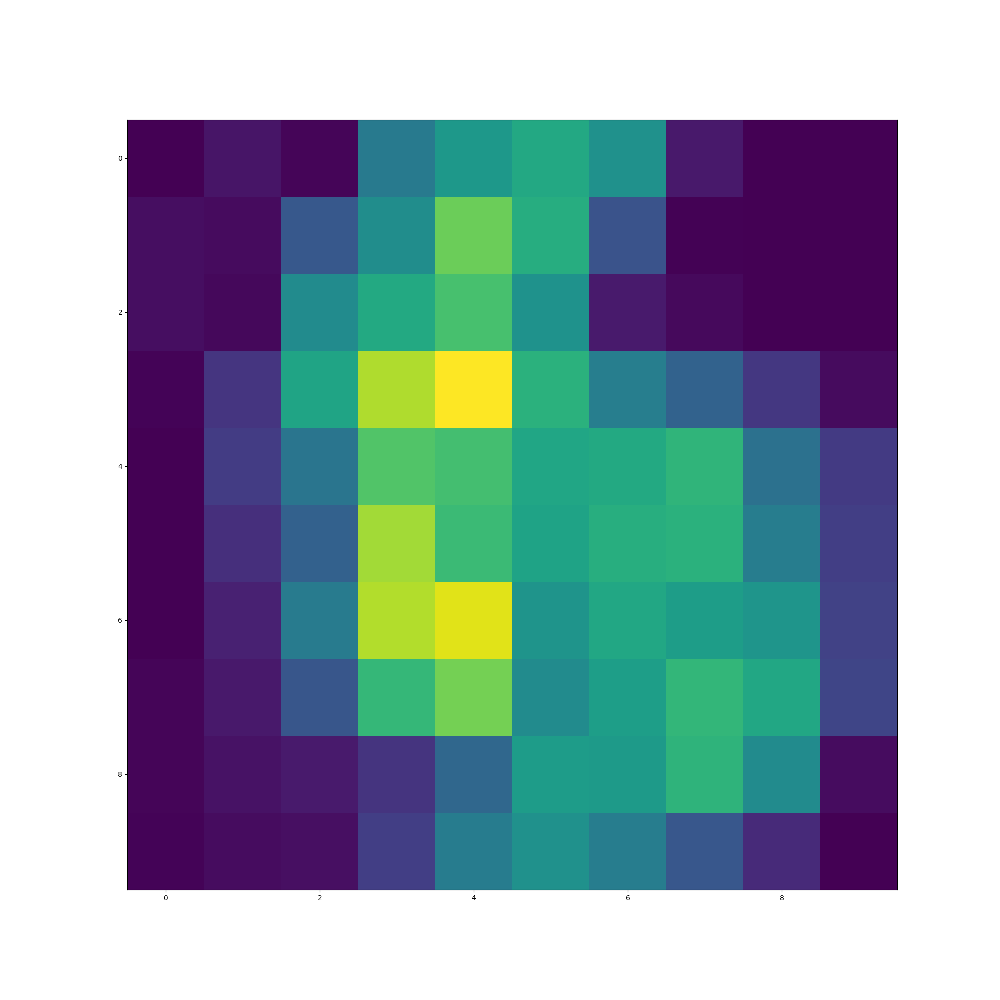
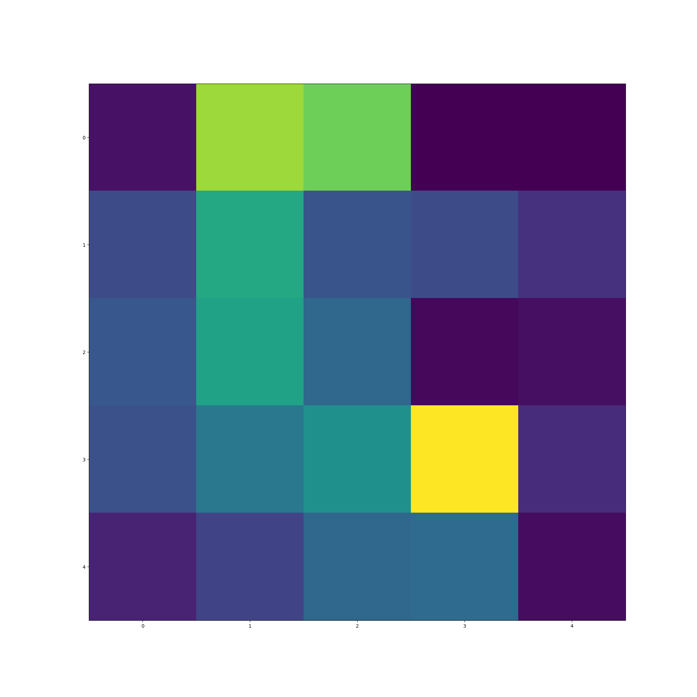
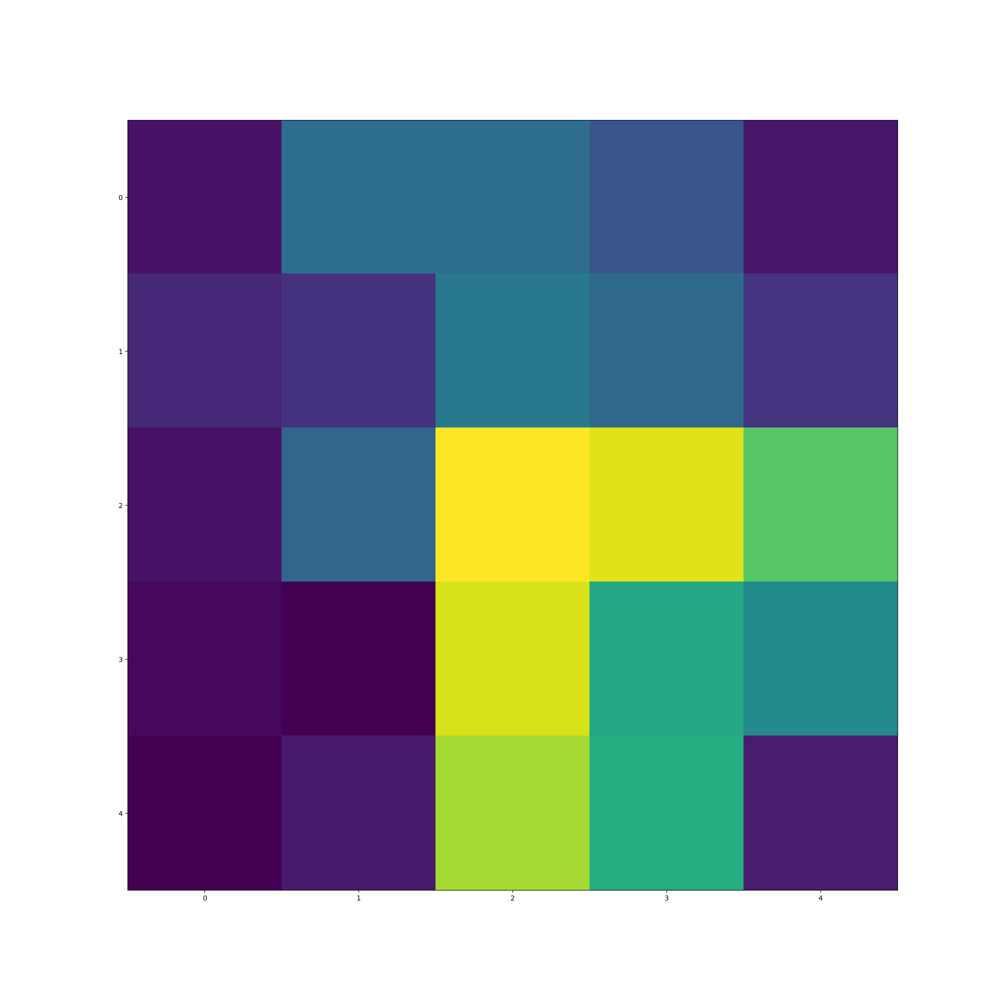

## Reconhecimento de dígitos manuscritos (HDR) usando rede neural convolucional (CNN) em SystemVerilog

O Reconhecimento de Dígitos Manuscritos é o processo de digitalização de imagens de dígitos manuscritos por humanos. É uma tarefa
difícil para a máquina, pois os dígitos manuscritos não são perfeitos e podem ser produzidos com uma variedade de variações. Neste projeto, desenvolvemos
um modelo de Rede Neural Convolucional (CNN) utilizando o SystemVerilog para o Reconhecimento de Dígitos Manuscritos. Uma rede neural convolucional
(CNN ou ConvNet) é um algoritmo de Aprendizado Profundo que pode receber uma imagem de entrada, atribuir pesos e vieses aprendíveis
a vários objetos na imagem e ser capaz de distingui-los.

## Layers da Rede Convolucional 

## Diagrama de blocos do SystemVerilog da Rede Convolucional 

## Entrada

## layer 1 - CONVOLUÇÃO 1

## layer 2 - MAXPOOLING 1

## layer 3 - CONVOLUÇÃO 2

## layer 4 - MAXPOOLING 2

## layer 5 - FLATTEN

## layer 6 - DENSE

## Exemplo de convolução matricial

Links úteis:
[Convolutional Neural Network | Deep Learning](https://developersbreach.com/convolution-neural-network-deep-learning/).

[CNN EXPAINER](https://poloclub.github.io/cnn-explainer/#article-convolution).

[Deep CNN-DESIGN](https://www.baeldung.com/cs/deep-cnn-design)

[Single-Layer CNN using Verilog](https://santoshsrivatsan24.github.io/ece564_project1.html)

[Verilog Neural Network](https://yycho0108.github.io/CompArchNeuralNet/)

[2D Convolution in Hardware](https://sistenix.com/sobel.html)

[Verilog Project Ideias](https://vlsiverify.com/verilog/verilog-project-ideas/)

[The Convolutional Filter](https://medium.com/advanced-deep-learning/cnn-operation-with-2-kernels-resulting-in-2-feature-mapsunderstanding-the-convolutional-filter-c4aad26cf32)

    
    
    

