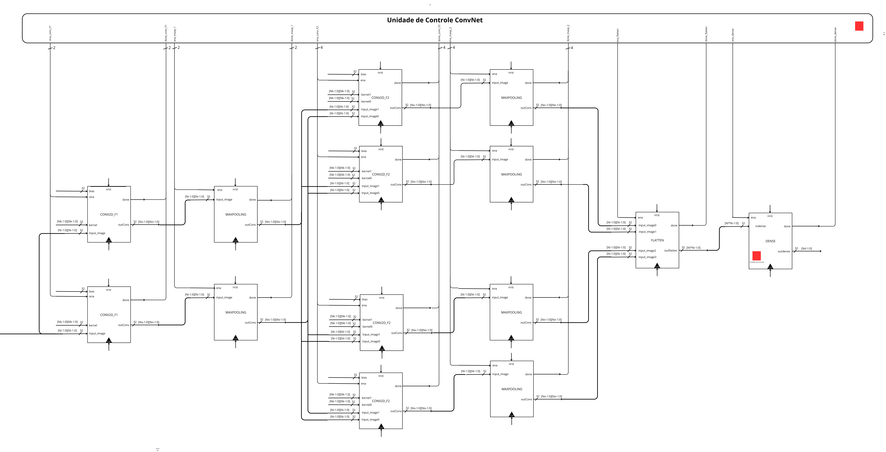
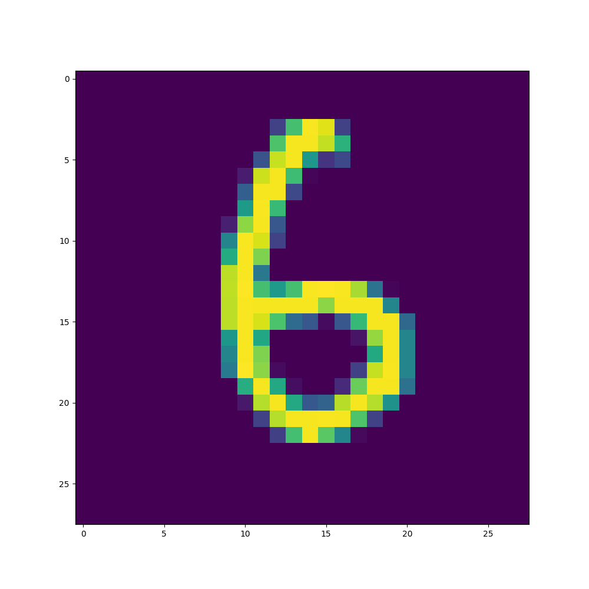
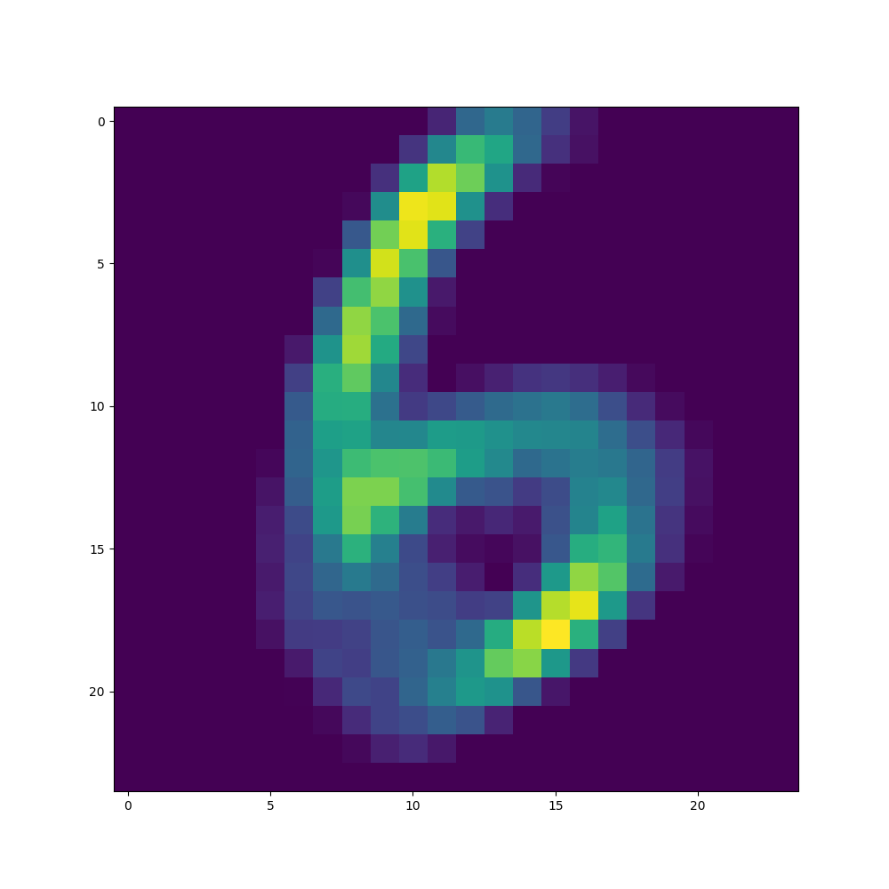
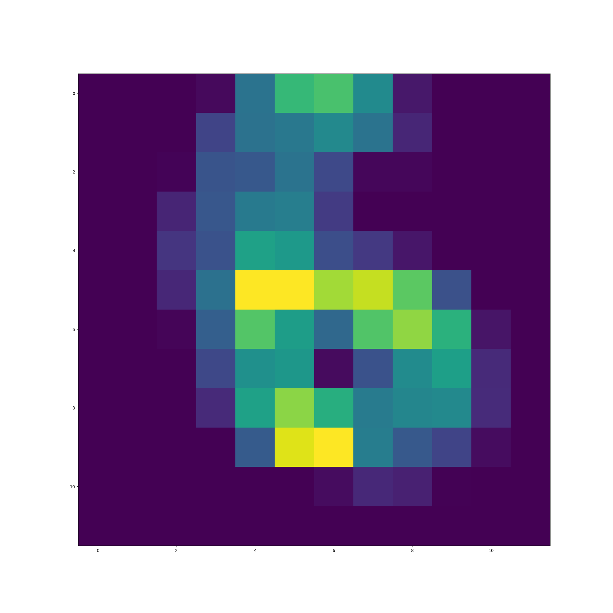

## Reconhecimento  dígitos manuscritos (HDR) usando re neural convolucional (CNN) em SystemVerilog

O Reconhecimento  Dígitos Manuscritos é o processo  digitalização  imagens  dígitos manuscritos por humanos. É uma tarefa
difícil para a máquina, pois os dígitos manuscritos não são perfeitos e pom ser produzidos com uma varieda  variações. Neste projeto, senvolvemos
um molo  Re Neural Convolucional (CNN) utilizando o SystemVerilog para o Reconhecimento  Dígitos Manuscritos. Uma re neural convolucional
(CNN ou ConvNet) é um algoritmo  Aprendizado Profundo que po receber uma imagem  entrada, atribuir pesos e vieses aprendíveis
a vários objetos na imagem e ser capaz  distingui-los.

## Layers da Re Convolucional 

## Diagrama  blocos do SystemVerilog da Re Convolucional 

## Entrada

## layer 1 - CONVOLUÇÃO 1

## layer 2 - MAXPOOLING 1

## layer 3 - CONVOLUÇÃO 2

## layer 4 - MAXPOOLING 2

## layer 5 - FLATTEN

## layer 6 - NSE

## Exemplo  convolução matricial

Links úteis:
[Convolutional Neural Network | ep Learning](https://velopersbreach.com/convolution-neural-network-ep-learning/).

[CNN EXPAINER](https://poloclub.github.io/cnn-explainer/#article-convolution).

[ep CNN-SIGN](https://www.baeldung.com/cs/ep-cnn-sign)

[Single-Layer CNN using Verilog](https://santoshsrivatsan24.github.io/ece564_project1.html)

[Verilog Neural Network](https://yycho0108.github.io/CompArchNeuralNet/)

[2D Convolution in Hardware](https://sistenix.com/sobel.html)

[Verilog Project Iias](https://vlsiverify.com/verilog/verilog-project-ias/)

[The Convolutional Filter](https://medium.com/advanced-ep-learning/cnn-operation-with-2-kernels-resulting-in-2-feature-mapsunrstanding-the-convolutional-filter-c4aad26cf32)
